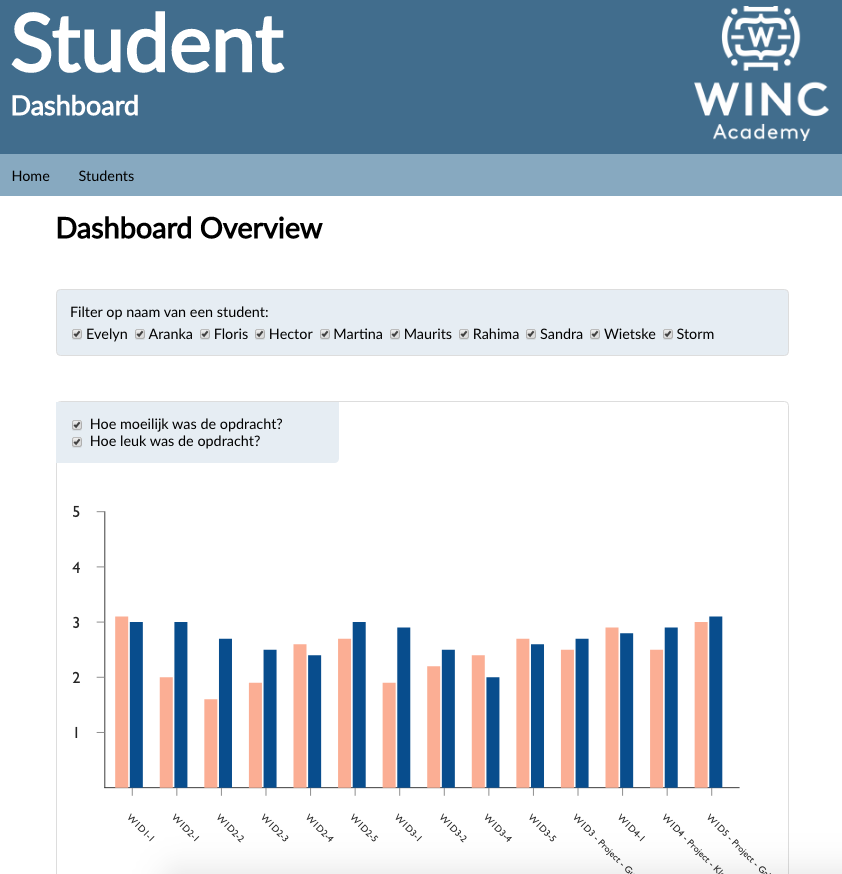

# **Eindproject Student Dashboard**
Winc Academy Eindproject - Week 6: Student Dashboard

Bekijk de live versie van de Student Dashboard: https://studentdashboard.netlify.app/

Als eindopdracht heb ik een "real life" project gemaakt. Een project waarvan het eindresultaat dus ook echt voor Winc Academy gebruikt kan gaan worden: namelijk een Student Dashboard!

## De Opdracht ##

***Doel***: het gemakkelijk maken voor Winc docenten om in één overzicht te zien hoe de studenten de opdrachten evalueren

***Wat is de huidige situatie***: Excellen, Excellen, Excellen..... 

***Design***: We zouden graag, per opdracht, de evaluatie van iedere student willen zien in een "Bar Chart".

***Tools:*** Maak gebruik van een JavaScript framework zoals React.

### Data ###

Er wordt gewerkt met mock data (met nep studenten). De data bevat opdracht-evaluaties die de studenten hebben ingevuld. 

Deze data heeft de volgende structuur:

- Naam van student
- Naam van de opdracht / project (met ook de project code erin)
- Cijfer hoe leuk de opdracht was
- Cijfer hoe moeilijk de opdracht was

Het is aan jullie om de data correct te modelleren en te structuren.

## Requirements

Jouw WebApplicatie **moet het volgende weergeven**

1. **Dashboard Overview 
User-story:** Als gebruiker wil ik als ik de homepage van de applicatie open een overzicht zien in de vorm van een **staafdiagram** van de evaluaties (leuk & moeilijk) van **alle studenten**. 

Als gebruiker moet ik in 1 oogopslag onderscheid kunnen maken tussen de opdrachten en de leuk/moeilijk evaluatie. Zorg ervoor dat er visueel een duidelijk onderscheid wordt gemaakt, door bijvoorbeeld met duidelijke kleuren te werken. Zie het voorbeeld met rood en geel hieronder.

2. **Per student aparte routing** 
Als gebruiker wil ik een lijst zien van de namen van alle studenten en op een van deze studenten kunnen klikken. Wanneer ik op een student-naam klik word ik naar de route `/{naam-van-student}` gebracht. De staafdiagram past zich aan met de data van alleen deze student. 

Tip: de chart blijft hetzelfde op de X en Y as, krijgt alleen "minder" data, namelijk de data van 1 student.

3. **Design**: Maak een tool waar je trots op bent en wat je aan een toekomstige werkgever zou willen laten zien. We letten vooral op: leesbaarheid van de grafieken.

4. **Slicen en dicen. - Kies één van de onderstaande manieren:**
Als gebruiker van de tool kan je op een aantal manieren de data "slicen en dicen". 
    - Optie 1: Als gebruiker wil ik dmv een checkbox kunnen aangeven of ik in de staafdiagram alléén wil laten zien hoe leuk de opdracht was, alléén wil zien hoe moeilijk de opdracht was, of beide.
    - Optie 2: Als gebruiker wil ik, naast het filteren op 1 persoon, ook kunnen filteren op meerdere personen. Ik wil daarom bij het overzicht van mijn studenten een checkbox zien die ik kan 
    - **aanvinken** als ik de data van deze specifieke student wil **includeren** in mijn grafiek 
    - **uitvinken** als ik de data van deze specifieke student wil **uitsluiten** uit mijn grafiek.
    - Optie 3: Als gebruiker wil ik een line-chart representatie zien van mijn data die het gemiddelde cijfer weergeeft voor "leuk" en het gemiddelde cijfer voor "moeilijk".
    - Optie 4: Als gebruiker wil ik kunnen zien hoe 1 specifieke opdracht heeft gescoord. Daarom wil ik een lijst zien van alle opdrachten die ik kan aanvinken om mij een staafdiagram te laten zien met op de y-as de score (zoals eerder) en op de x-as de namen van de studenten.

## Grafieken maken met een Library!

Je bent vrij om je eigen grafieken-library uitkiezen en gebruiken, een relatief simpele library is Victory.

## **Bonus features**

- Zorg dat men de data op meer dan 1 manier kan "slicen en dicen" (zie requirement 3).
- **Tabel overzicht** van alle data ⇒ dus als een Excel spreadsheet. Je mag hierbij zelf bepalen hoe je de kolommen / rijen wilt structureren:
    - Je kunt nog steeds kan filteren op alle bovenstaande manieren
    - Toevoegen van sorteren per data kolom
- **Gebruikers profielen**. Door gebruik te maken van de API van kunnen jullie snel en eenvoudig objects ophalen met nep data erin. Voor elke studentenpagina kunnen jullie vervolgens een profiel toevoegen en de fictieve studenten verder verrijken met:
    - Achternaam
    - Leeftijd
    - Telefoonnummer
    - Email adres
    - Photo (URL)
    - ❗Let wel op de rate limiting van deze API – als je te vaak en teveel een call doet wordt je (tijdelijk) geblokkeerd
- Alles opslaan en beheren in Redux .
- **Sorteren** van de bar charts van opdrachten op gemiddelde cijfer (hoog naar laag of laag naar hoog).
- **Sorteren** van de studenten op gemiddelde cijfers (hoog naar laag of laag naar hoog).

